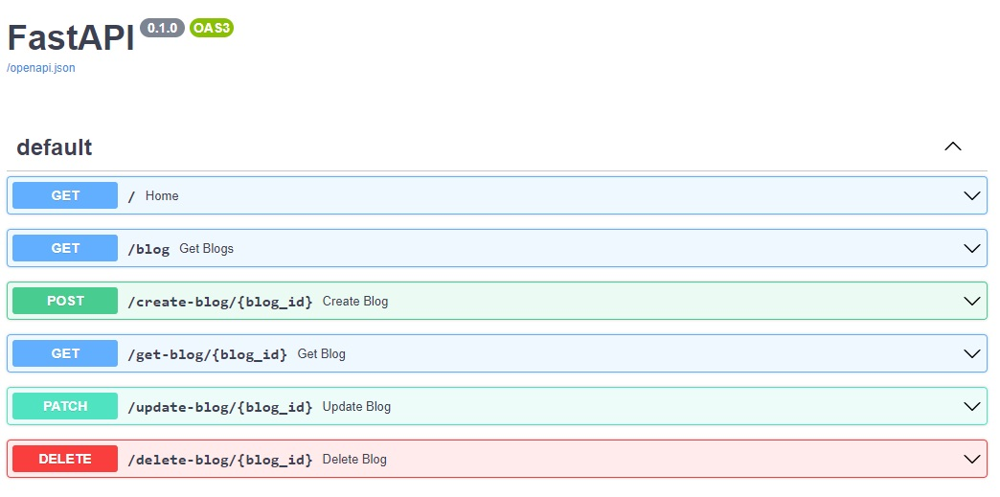

### Mini blog
##### Built on Python + FastAPI

The objective is to create a simple blog with REST API which will perform basic CRUD functions:
- Create a new blog post
- Edit a blog 
- Delete a blog 
- Show blogs
- Show a single blog

### Clone and open locally
- Install fastapi using "pip/pip3/ install fastapi"
- Install uvicorn using "pip/pip3/ install uvicorn"
- if you are using env, start the shell - "pipenv shell"
- start the server using "uvicorn app:app"

To test the functions open /localhost/docs, you should see the following fields:

